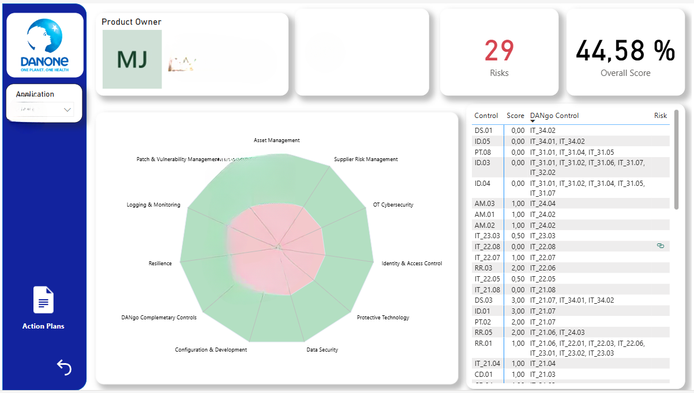

# 💻 David Bazaldua | Data Science

🎓 **Data Science & Mathematics Engineer** | 🏢 **Experience: Danone | TELUS International**  
📊 Specializing in **Machine Learning, Python, SQL, R, Deep Learning, Applied Mathemathics, Power BI & Data Visualization**  

📍 Mexico City | 📧 [david.bazmen@gmail.com](mailto:david.bazmen@gmail.com)  
🔗 [LinkedIn](https://www.linkedin.com/in/david-bazald%C3%BAa-m%C3%A9ndez-972630277/) | 🏠 [Portfolio](https://david-bazalduaa.github.io/David_Portfolio/)

---

## **Featured Projects**
Here are some of my most relevant projects in Data Science, Machine Learning, and Optimization with strong visual skills in Power BI.

### **1. IMSS Morbidity and Case Prediction**  
🔹 **Description:** Developed a **Neural Network (Keras) model** to predict health trends for the next three years using real-world data.  
🔹 **Tools & Technologies:** Python, Keras, Pandas, Power BI  
🔹 **Results:** Provided actionable insights for IMSS decision-makers, improving forecast accuracy through hyperparameter tuning.  

📌 **Repository:** [🔗 GitHub](https://github.com/david-bazalduaa/IMSS-predictive-cases)  
📊 **Power BI Dashboard:**  
  

---

### **2. Healthy Fast Food Optimization**  
🔹 **Description:** Designed a **linear programming** model to help users optimize their fast-food meal selections based on calorie intake and nutrition goals.  
🔹 **Tools & Technologies:** Python, Numpy, Pandas, Linear Programming  
🔹 **Results:** Developed a **prototype application** that suggests the most optimal meal choices for fast-food users.  

📌 **Repository:** [🔗 GitHub](https://github.com/david-bazalduaa/Healthy-Fast-Food-App)   
📊 **Model Visualization:**  
  

---

### **3. Air Pollution Data Analysis (Mexico City)**  
🔹 **Description:** Analyzed **contaminant levels** (O3, NO2, CO, etc.) in different **geographical areas** in Mexico City using real-world **2022 data**.  
🔹 **Tools & Technologies:** Python, Pandas, Matplotlib, Seaborn  
🔹 **Results:** Created **visualizations & time-series insights** to identify pollution trends.  

📌 **Repository:** [🔗 GitHub](https://github.com/david-bazalduaa/Air-Pollution-Contingency-Prediction-)

---

### **4. PCA on Banknote Data**  
🔹 **Description:** Applied **dimensionality reduction techniques** (PCA) to a **banknote authentication dataset**.  
🔹 **Tools & Technologies:** Python, NumPy, Pandas  
🔹 **Results:** Improved data efficiency by reducing feature space while maintaining classification accuracy.  

📌 **Repository:** [🔗 GitHub](https://github.com/david-bazalduaa/PCA-BankData)   

---

## **Work Experience**

My professional journey—especially at **Danone**—has allowed me to design and implement **data-driven dashboards** that support strategic decisions across cybersecurity, risk monitoring, and IT operations.

### **1. Cybersecurity Risk Dashboard (Danone)**  
🔹 **Description:** Built a comprehensive dashboard to analyze and monitor **potential risks across critical applications** within Danone. This dashboard simplifies communication for stakeholders, helping identify vulnerabilities in areas such as Data Security, Identity & Access Control, and Resilience.  
🔹 **Tools & Technologies:** Power BI, DAX, Excel, Control Matrix Integration  
🔹 **Results:** Enabled risk-based prioritization, fostering faster decision-making across IT & Compliance teams.  

📌 **Dashboard Preview:**  
  
_**Note:** Some sections have been blurred to comply with Danone’s data confidentiality policies._

---

### **2. SAP Incident Management Dashboard (Danone)**  
🔹 **Description:** Created a live dashboard to **track incident resolution across SAP modules**, helping department leaders visualize workload and improve SLA adherence.  
🔹 **Tools & Technologies:** Power BI, Excel Automation  
🔹 **Results:** Improved visibility into ticket handling, which significantly **reduced resolution time** and enhanced the coordination between SAP support teams and business users.  

📌 **Dashboard Preview:**  
  
_**Note:** Dashboard contains blurred data to preserve internal confidentiality._

---

## 📬 **Contact**
📧 **Email:** [david.bazmen@gmail.com](mailto:david.bazmen@gmail.com)  
🔗 **LinkedIn:** [David Bazaldúa Méndez](https://www.linkedin.com/in/david-bazald%C3%BAa-m%C3%A9ndez-972630277/)  

